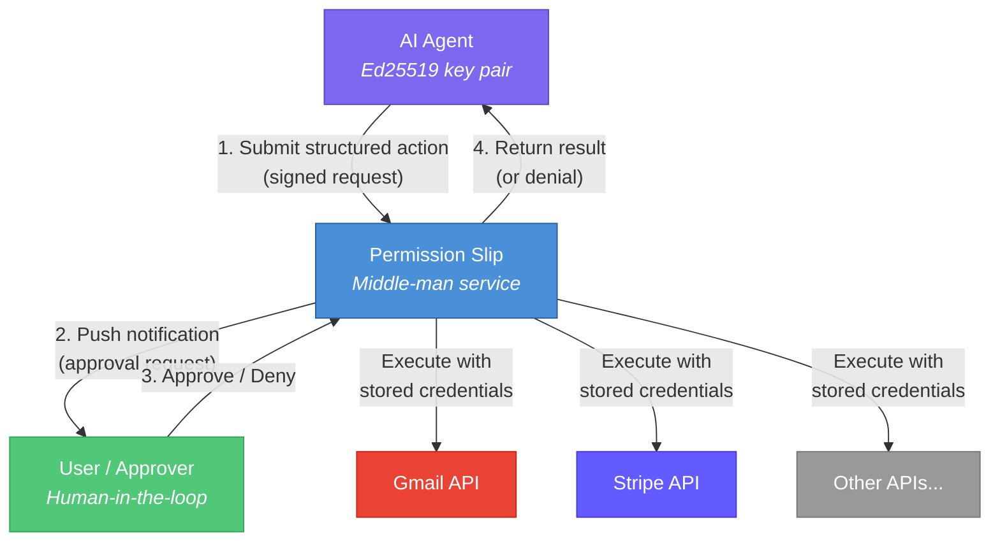
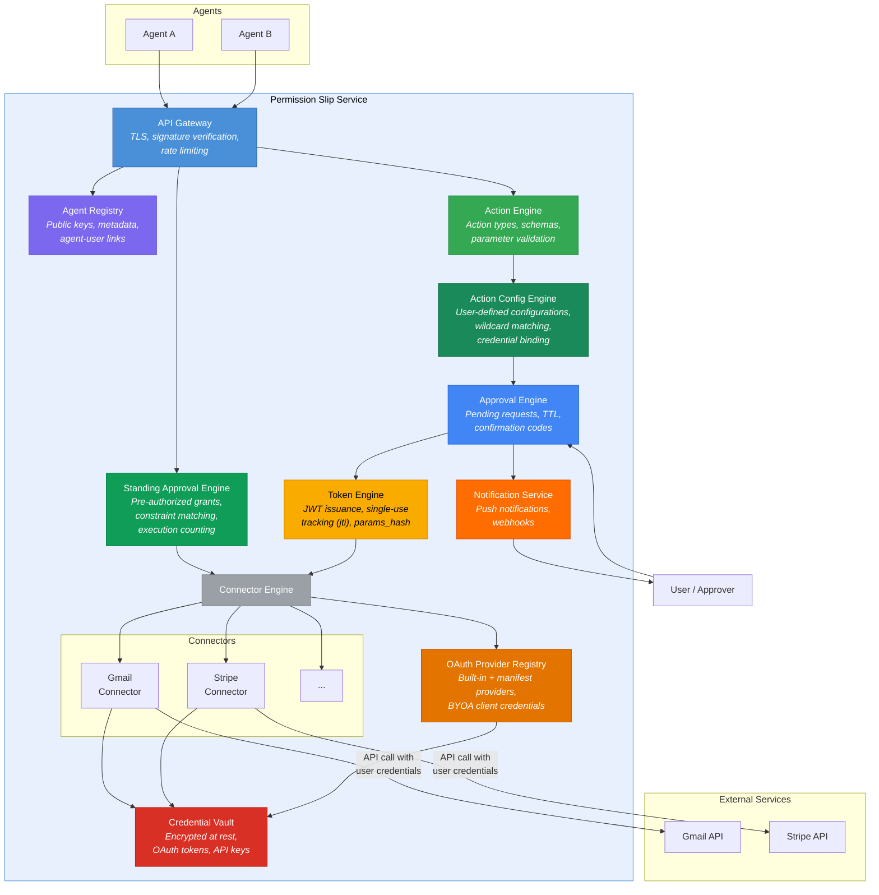
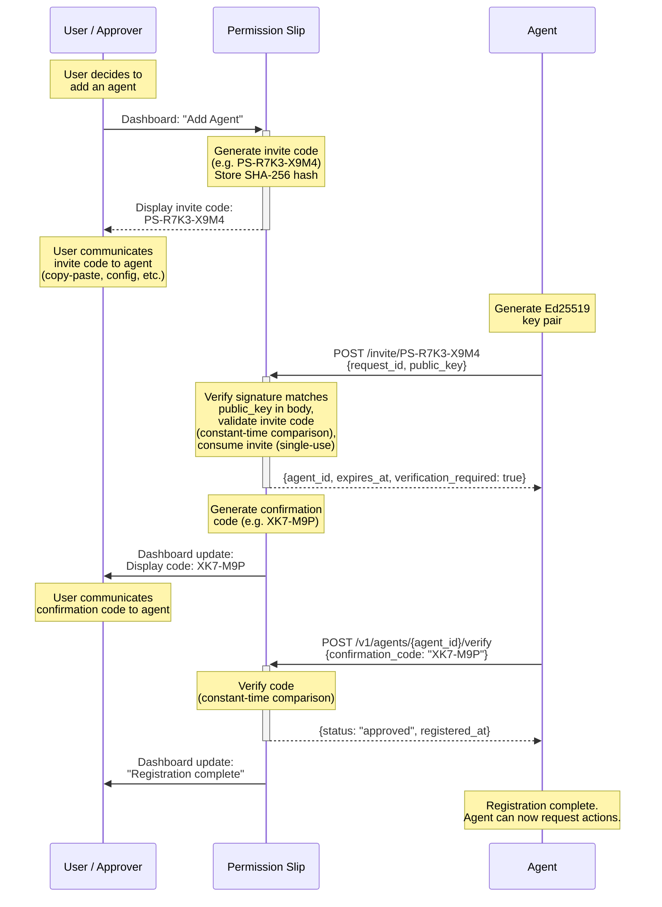
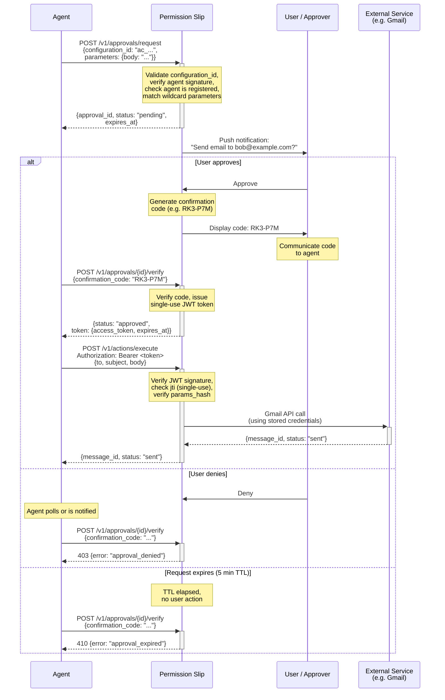
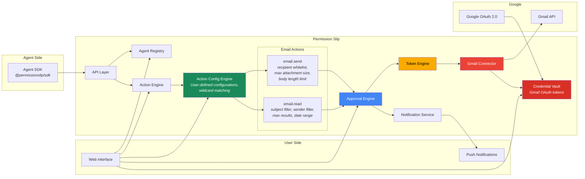
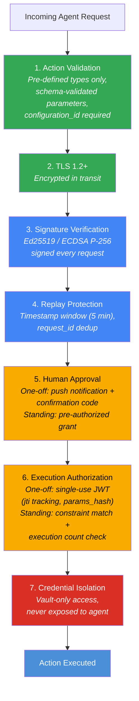

# Permission Slip — Architecture Diagrams

## System Context



## Internal Components

> The Connector Engine and individual connectors shown below are implemented as Go interfaces compiled into the binary. See [ADR-009](adr/009-connector-execution-architecture.md) for the execution architecture.



## Background Jobs

The server runs periodic background jobs when a database connection is configured. Both jobs are started on server boot, run immediately once, then repeat on a configurable interval. They respect context cancellation for graceful shutdown.

| Job | Default Interval | Description |
|-----|-----------------|-------------|
| **Audit log purge** | 1 hour (`AUDIT_PURGE_INTERVAL`) | Deletes expired audit events to prevent unbounded table growth. |
| **OAuth token refresh** | 10 minutes (`OAUTH_REFRESH_INTERVAL`) | Proactively refreshes OAuth access tokens expiring within 15 minutes. Tokens that fail to refresh (revoked, expired refresh token) are marked `needs_reauth`, prompting the user to re-authorize. |

## Agent Registration Flow

> Registration is **user-initiated** via invite codes. See [ADR-005](adr/005-user-initiated-registration.md) for the rationale.

### Agent-facing flow (confirmation code)

The standard flow: agent registers via invite URL, user shares a confirmation code out-of-band, agent submits the code to complete registration.



### Dashboard-facing flow (direct registration)

Alternative flow: user completes registration directly from the dashboard UI without exchanging a confirmation code with the agent. Uses session auth (Supabase JWT).

- **Endpoint**: `POST /v1/agents/{agent_id}/register` (session-authenticated)
- Transitions agent from `pending` → `registered`, sets `registered_at`
- Emits `agent.registered` audit event
- Returns 409 if agent is already registered or deactivated

## Action Approval & Execution Flow



## Email MVP — Component View

Focused on the components involved in the Email MVP user stories.



## Security Layers



## Data Model (Email MVP)

```mermaid
erDiagram
    USER {
        string user_id PK
        string username
        string email
    }

    REGISTRATION_INVITE {
        string id PK
        string user_id FK
        string invite_code_hash "SHA-256"
        string status "active | consumed | expired"
        int verification_attempts
        timestamp expires_at
        timestamp created_at
    }

    AGENT {
        bigint agent_id PK "auto-incrementing"
        string public_key
        string name
        string version
        timestamp registered_at
    }

    CREDENTIAL {
        string credential_id PK
        string user_id FK
        string service "gmail"
        blob vault_secret_id "Vault reference"
    }

    CONNECTOR {
        string id PK "gmail, stripe, etc."
        string name
        string description
    }

    AGENT_CONNECTOR {
        bigint agent_id FK
        string approver_id FK
        string connector_id FK
        timestamp enabled_at
    }

    APPROVAL_REQUEST {
        string approval_id PK
        bigint agent_id FK
        string user_id FK
        string action_type
        json parameters
        string status "pending | approved | denied | expired | cancelled"
        string confirmation_code
        int failed_attempts
        timestamp expires_at
        timestamp created_at
    }

    TOKEN {
        string jti PK
        string approval_id FK
        string scope "action type"
        string params_hash "SHA-256 of JCS params"
        boolean consumed
        timestamp expires_at
    }

    ACTION_CONFIGURATION {
        string id PK "ac_ prefix"
        bigint agent_id FK
        string user_id FK
        string connector_id FK
        string action_type FK "composite with connector_id"
        string credential_id FK "nullable, SET NULL"
        json parameters "fixed values or wildcard *"
        string status "active | disabled"
        string name
        string description "nullable"
        timestamp created_at
        timestamp updated_at
    }

    STANDING_APPROVAL {
        string standing_approval_id PK
        bigint agent_id FK
        string user_id FK
        string action_type "email.read | email.send"
        string action_version "1"
        json constraints "same schema as ACTION_CONFIG"
        string status "active | expired | revoked | exhausted"
        int max_executions "null = unlimited"
        int execution_count "current count"
        timestamp starts_at
        timestamp expires_at "null = no expiration"
        timestamp created_at
        timestamp revoked_at "null if not revoked"
    }

    STANDING_APPROVAL_EXECUTION {
        bigint id PK
        string standing_approval_id FK
        json parameters "optional execution params"
        timestamp executed_at
    }

    AUDIT_EVENT {
        bigint id PK
        string user_id FK
        bigint agent_id FK
        string event_type "approval.approved | approval.denied | approval.cancelled | agent.registered | agent.deactivated | standing_approval.executed"
        string outcome
        string source_id "approval_id or agent_id"
        string source_type "approval | agent | standing_approval"
        json agent_meta "point-in-time agent metadata snapshot"
        json action "action context (optional)"
        timestamp created_at
    }

    USER ||--o{ REGISTRATION_INVITE : "creates invite"
    REGISTRATION_INVITE ||--o| AGENT : "authorizes registration"
    USER ||--o{ AGENT : registers
    USER ||--o{ CREDENTIAL : "stores (user-scoped)"
    AGENT ||--o{ AGENT_CONNECTOR : "enabled for"
    AGENT_CONNECTOR }o--|| CONNECTOR : "references"
    AGENT ||--o{ ACTION_CONFIGURATION : "configured for"
    USER ||--o{ ACTION_CONFIGURATION : creates
    CONNECTOR ||--o{ ACTION_CONFIGURATION : "provides action"
    CREDENTIAL ||--o{ ACTION_CONFIGURATION : "bound to (nullable)"
    AGENT ||--o{ APPROVAL_REQUEST : submits
    USER ||--o{ APPROVAL_REQUEST : reviews
    APPROVAL_REQUEST ||--o| TOKEN : "issues (on approve)"
    USER ||--o{ STANDING_APPROVAL : creates
    AGENT ||--o{ STANDING_APPROVAL : "authorized by"
    STANDING_APPROVAL ||--o{ STANDING_APPROVAL_EXECUTION : "tracks executions"
    STANDING_APPROVAL ||--o{ AUDIT_EVENT : "generates (per execution)"
    USER ||--o{ AUDIT_EVENT : owns
    AGENT ||--o{ AUDIT_EVENT : generates
