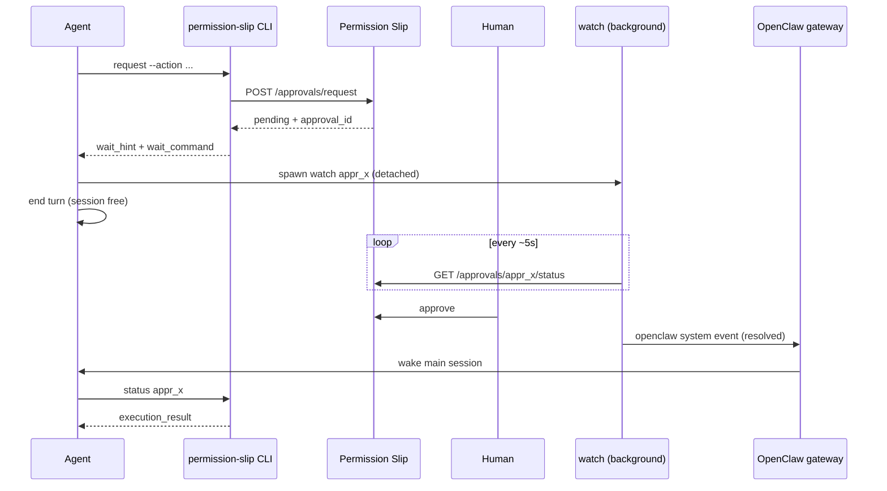

# OpenClaw + Permission Slip — Non-blocking approvals

How OpenClaw agents wait for human approval without blocking the session.

## The problem

When an agent requests an approval-gated action, `permission-slip request` returns `pending` and an `approval_id`. The agent must learn the outcome somehow.

Polling `permission-slip status` inside the agent's turn is a poor fit for LLM agents:

- **Busy-polling** makes the session appear hung while waiting.
- **Ending the turn and checking later** means the user may approve, but the agent does not notice until it happens to wake again.

The Permission Slip dashboard has realtime SSE for approvers, but agents had no push channel — until the detached watcher pattern.

## The solution: detached watcher + local wake

OpenClaw provides:

- **Background exec** — spawn a process that outlives the agent's turn.
- **`openclaw system event --text "..." --mode now`** — enqueue a system event on the local gateway socket to wake the main session immediately. No HTTP hooks, no webhook configuration.

### Flow



1. Agent runs `permission-slip request ...` → gets `pending`, `approval_id`, `wait_command`.
2. Agent spawns `permission-slip watch <approval_id>` as a **detached background process** and **ends its turn**.
3. The watcher polls `GET /approvals/{id}/status` every ~5 seconds.
4. On terminal status (approved, denied, cancelled, etc.), expiry, or 404, the watcher runs the notify command (default: `openclaw system event`) and exits.
5. The gateway wakes the main session; the agent fetches the result with `permission-slip status <id>` and continues.

Wake latency is roughly one poll interval after the human acts (~5 seconds by default).

## Setup

1. Install and register the CLI per [agents.md](../agents.md).
2. Ensure `openclaw` is on PATH (default notify command), or pass `--notify-cmd` to `watch`.
3. Optional: install the [permission-slip-approvals skill](../../skills/permission-slip-approvals/SKILL.md) so the pattern is pre-taught — but **the CLI output is the primary discovery path** (`wait_hint` / `wait_command` on pending `request` and `status` responses).

## Commands

### Request (pending output)

When status is `pending`, JSON includes:

```json
{
  "status": "pending",
  "approval_id": "appr_x",
  "expires_at": "2026-07-03T12:00:00Z",
  "wait_hint": "Do NOT poll in a loop and do NOT block. Run the following command AS A DETACHED BACKGROUND PROCESS, then end your turn; you will be woken with the outcome when the human responds:",
  "wait_command": "permission-slip watch appr_x"
}
```

### Watch

```bash
permission-slip watch <approval_id> [--interval 5s] [--session-key <key>] [--notify-cmd '<cmd with {id} {status} {session_key}>']
```

Designed to run as a detached background process. Prints one JSON line and exits on any terminal outcome.

Default notify (when `openclaw` is on PATH) sends the wake message via `openclaw system event --text "{message}" --mode now` on the main session. When `--session-key` is set, the default switches to `--mode next-heartbeat --session-key <key>` because OpenClaw treats that combination as an immediate targeted wake that reliably resumes idle/yielded sessions (`--mode now --session-key` can return RPC ok without waking the session).

`watch` JSON output includes `notify_attempts` with the shell command(s) run and whether each exited successfully. `notified: true` only means the notify command did not throw — it does not confirm the gateway delivered a new agent turn.

### Status (redirect)

If an agent polls `permission-slip status <id>` while still pending, the same `wait_hint` and `wait_command` fields are included to redirect it to the watcher pattern.

## Multiple pending approvals

Use **one watcher per approval**. N pending approvals ⇒ N small background processes. This is acceptable at personal-use scale.

## Troubleshooting

| Symptom | Likely cause | Recovery |
|--------|--------------|----------|
| Agent never wakes after approve | Watcher not running, notify failed, or OpenClaw targeted wake issue | Check watcher process and `notify_attempts` in watch JSON; re-run `permission-slip watch <id> --session-key <key>` |
| `notified: true` but session stays idle | Gateway RPC ok ≠ session resumed (common with `--mode now --session-key`) | Use default notify with `--session-key` (uses `--mode next-heartbeat` since 0.1.21) or pass a custom `--notify-cmd` |
| Wake fired but a different/stale session answered | Watcher used default session instead of the waiting session | Re-run `watch` with `--session-key <your session key>` |
| Watcher orphaned after gateway restart | Background process lost | On next interaction, `permission-slip status <id>` or re-run `watch` |
| `No notify command available` | `openclaw` not on PATH and no `--notify-cmd` | Install OpenClaw CLI or pass `--notify-cmd` |
| Session hung while waiting | Agent polling in-loop instead of using `watch` | Read `wait_hint` from `request` / `status` output |

## Non-goals (this integration)

- **`status --wait` / long-poll** — deferred; the sleep-loop watcher is sufficient at this scale.
- **Server-side webhook callbacks** — rejected; no extra exposed HTTP surface.
- **Agent-authenticated SSE** — not implemented; local system events are preferred for OpenClaw.

## Related

- [OpenClaw integration guide (full API)](../agents.md)
- [permission-slip-approvals skill](../../skills/permission-slip-approvals/SKILL.md)
