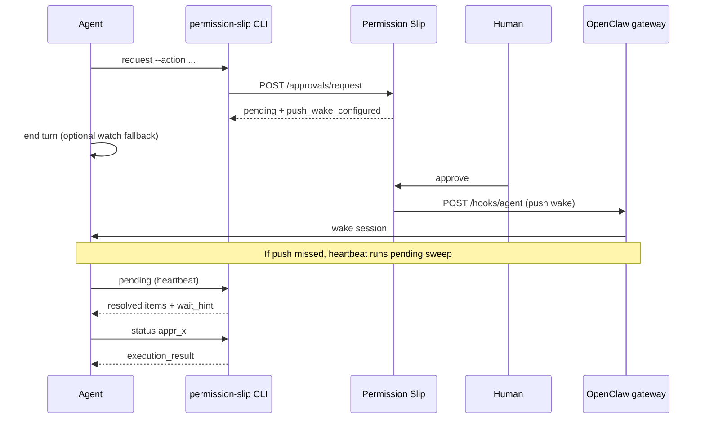

# OpenClaw + Permission Slip — Non-blocking approvals

How OpenClaw agents wait for human approval without blocking the session.

## The problem

When an agent requests an approval-gated action, `permission-slip request` returns `pending` and an `approval_id`. The agent must learn the outcome somehow.

Polling `permission-slip status` inside the agent's turn is a poor fit for LLM agents:

- **Busy-polling** makes the session appear hung while waiting.
- **Ending the turn and checking later** means the user may approve, but the agent does not notice until it happens to wake again.

The Permission Slip dashboard has realtime SSE for approvers, but agents need their own delivery path.

## The solution: three layers

Reliable wake delivery uses independent layers so no single failure strand leaves approvals unnoticed:

| Layer | Mechanism | Latency |
|-------|-----------|---------|
| **1 — Push (primary)** | Server POSTs to OpenClaw `hooks/wake` / `hooks/agent` on resolution | ~1s |
| **2 — Heartbeat sweep (backstop)** | `permission-slip pending` on every heartbeat | ≤ heartbeat interval |
| **3 — Detached watcher (fallback)** | `permission-slip watch` when no webhook is configured | ~5s poll |



## Setup

1. Install and register the CLI per [agents.md](../agents.md).
2. **Push wakes (recommended):** enable OpenClaw gateway hooks, then register the hooks URL and token from either:
   - **Dashboard:** open the agent's settings page → **Push Wake Webhook** → configure URL + token and use **Test wake**
   - **CLI:**
   ```bash
   permission-slip webhook set --url http://<tailnet-host>:18789/hooks --token <hooks-token>
   permission-slip webhook status --test
   ```
   See [Self-hosted deployment — OpenClaw push wakes](../deployment-self-hosted.md#openclaw-push-wakes).
3. **Heartbeat backstop:** ensure OpenClaw heartbeat is enabled; the skill instructs running `permission-slip pending` each beat.
4. **Watcher fallback:** when no webhook is configured, pending `request` / `status` output still includes `wait_hint` + `wait_command` for `permission-slip watch`.

## Commands

### Webhook registration

Configure from the agent settings page (**Push Wake Webhook** section) or via CLI:

```bash
permission-slip webhook set --url http://100.x.x.x:18789/hooks --token <token>
permission-slip webhook status          # show config
permission-slip webhook status --test   # fire test wake
permission-slip webhook clear           # remove config
```

In the dashboard, **Test wake** on the agent settings page fires the same test delivery as `webhook status --test` and shows success/failure plus latency.

The hooks URL must resolve to a **private** address (RFC1918, Tailscale `100.64.0.0/10`, or loopback). Public URLs are rejected at registration.

If another of your agents is already registered with the same hooks URL, `webhook set` and `webhook status` include an advisory `warning` field. Sharing one gateway across agents is allowed, but wakes without `session_key` in approval context are delivered to the gateway's main session and may reach the wrong agent — pass `session_key` in approval context for shared-gateway setups, or give each agent its own gateway.

### Heartbeat sweep

```bash
permission-slip pending
permission-slip pending --resolved-since 2026-07-03T12:00:00Z
```

Returns `pending` and `resolved` arrays. When `resolved` is non-empty, a `wait_hint` tells the agent to fetch outcomes with `permission-slip status`.

### Request (pending output)

When status is `pending`, JSON includes `push_wake_configured` when a webhook is registered:

```json
{
  "status": "pending",
  "approval_id": "appr_x",
  "push_wake_configured": true,
  "wait_hint": "A push wake webhook is configured — the server will wake your OpenClaw gateway when the human responds (watcher optional)...",
  "wait_command": "permission-slip watch appr_x"
}
```

### Watch (fallback)

```bash
permission-slip watch <approval_id> [--session-key <key>]
```

Use when no webhook is configured, or as an extra safety net. See [permission-slip-approvals skill](../../skills/permission-slip-approvals/SKILL.md).

## Troubleshooting

| Symptom | Likely cause | Recovery |
|--------|--------------|----------|
| Agent never wakes after approve | Webhook not registered, gateway down, or bad token | Agent settings → **Test wake**, or `permission-slip webhook status --test`; check gateway logs |
| Push missed but heartbeat works | Transient network blip | Expected — sweep picks it up; verify heartbeat runs `pending` |
| `invalid_webhook_url` at registration | Public URL or DNS to public IP | Use tailnet / LAN address only |
| `webhook status --test` fails | Gateway unreachable from server host | Agent settings → **Test wake**, or `curl` hooks URL from server over tailnet |
| No webhook configured | Normal — watcher path unchanged | Run `wait_command` or register webhook |

## Related

- [OpenClaw integration guide (full API)](../agents.md)
- [permission-slip-approvals skill](../../skills/permission-slip-approvals/SKILL.md)
- [Self-hosted deployment — OpenClaw push wakes](../deployment-self-hosted.md#openclaw-push-wakes)
