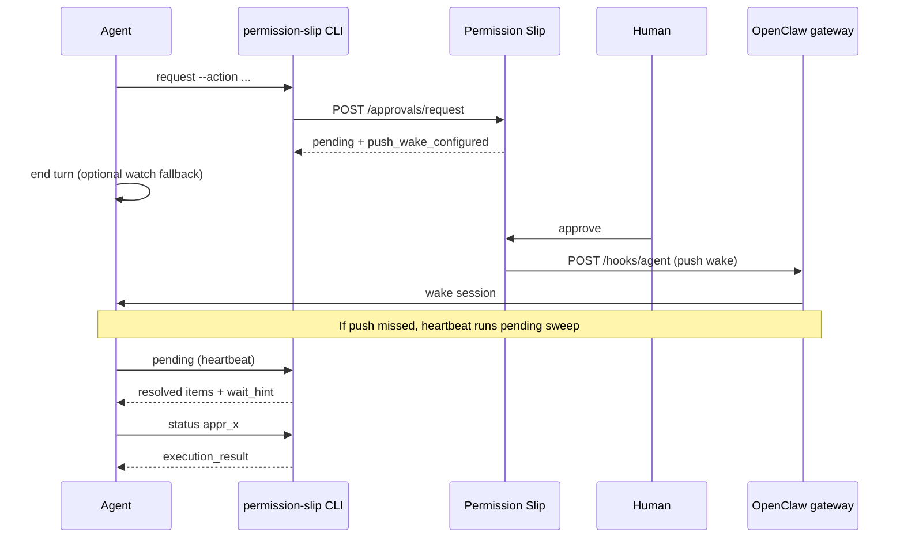

# OpenClaw + Permission Slip — Non-blocking approvals

How OpenClaw agents wait for human approval without blocking the session.

## The problem

When an agent requests an approval-gated action, `permission-slip request` returns `pending` and an `approval_id`. The agent must learn the outcome somehow.

Polling `permission-slip status` inside the agent's turn is a poor fit for LLM agents:

- **Busy-polling** makes the session appear hung while waiting.
- **Ending the turn and checking later** means the user may approve, but the agent does not notice until it happens to wake again.

The Permission Slip dashboard has realtime SSE for approvers, but agents need their own delivery path.

## The solution: three layers

Reliable wake delivery uses independent layers so no single failure strand leaves approvals unnoticed:

| Layer | Mechanism | Latency |
|-------|-----------|---------|
| **1 — Push (primary)** | Server POSTs to OpenClaw `hooks/wake` / `hooks/agent` on resolution | ~1s |
| **2 — Heartbeat sweep (backstop)** | `permission-slip pending` on every heartbeat | ≤ heartbeat interval |
| **3 — Detached watcher (fallback)** | `permission-slip watch` when no webhook is configured | ~5s poll |



## Setup

1. Install and register the CLI per [agents.md](../agents.md).
2. **Push wakes (recommended):** enable OpenClaw gateway hooks, then register the hooks URL and token from either:
   - **Dashboard:** open the agent's settings page → **Push Wake Webhook** → configure URL + token and use **Test wake**
   - **CLI:**
   ```bash
   permission-slip webhook set --url http://<tailnet-host>:18789/hooks --token <hooks-token>
   permission-slip webhook status --test
   ```
   Grok Bot agents use `--provider grokbot` and a public Cursor webhook URL instead — see [Grok Bot](#grok-bot).
   See [Self-hosted deployment — OpenClaw push wakes](../deployment-self-hosted.md#openclaw-push-wakes).
3. **Heartbeat backstop:** ensure OpenClaw heartbeat is enabled; the skill instructs running `permission-slip pending` each beat.
4. **Watcher fallback:** when no webhook is configured, pending `request` / `status` output still includes `wait_hint` + `wait_command` for `permission-slip watch`.

## Commands

### Webhook registration

Configure from the agent settings page (**Push Wake Webhook** section) or via CLI:

```bash
permission-slip webhook set --url http://100.x.x.x:18789/hooks --token <token>
permission-slip webhook set --provider grokbot \
  --url https://api2.cursor.sh/automations/webhook/<id> \
  --token <authorization-header-value>
permission-slip webhook status          # show config (includes provider)
permission-slip webhook status --test   # fire test wake
permission-slip webhook clear           # remove config
```

In the dashboard, **Push Wake Webhook** has an **OpenClaw** / **Grok Bot** provider dropdown. **Test wake** fires the selected provider's delivery and shows success/failure plus latency.

For **OpenClaw**, the hooks URL must resolve to a **private** address (RFC1918, Tailscale `100.64.0.0/10`, or loopback). Public URLs are rejected at registration. This check is not relaxed for OpenClaw.

For **Grok Bot**, the URL must be a public Cursor automation webhook: `https://api2.cursor.sh/automations/webhook/<id>`. The server POSTs to that URL as-is (no `/hooks/wake` suffix).

If another of your agents is already registered with the same hooks URL, `webhook set` and `webhook status` include an advisory `warning` field. Sharing one gateway across agents is allowed, but wakes without `session_key` in approval context are delivered to the gateway's main session and may reach the wrong agent — pass `--session-key` on `request` (or `session_key` in API context) for shared-gateway setups, or give each agent its own gateway.

### Push wake payloads (what Permission Slip POSTs)

On approval resolution, the server POSTs to your registered hooks **base URL** plus a path suffix. Permission Slip does not use custom hook mapping subpaths — it calls OpenClaw's built-in hooks API directly.

| Branch | When | Path | JSON body |
|--------|------|------|-----------|
| **Session-targeted** | `session_key` present in approval context | `{base}/agent` | `{ "message": "<text>", "wakeMode": "next-heartbeat", "sessionKey": "<key>" }` |
| **Main session fallback** | `session_key` absent | `{base}/wake` | `{ "text": "<text>", "mode": "now" }` |

The human-readable `message` / `text` is always of the form `Permission Slip <approval_id> resolved: <status> — continue the task` (or an expiry variant).

**Why `wakeMode: next-heartbeat` vs `mode: now`?** OpenClaw treats `/hooks/agent` with `wakeMode: next-heartbeat` as an immediate resume of the identified session's conversation. The `/hooks/wake` fallback uses `mode: now`, which wakes the gateway's **main** session — fine for a dedicated single-agent gateway, but wrong on a shared gateway or when the approval was opened from a specific Telegram/iMessage chat.

**OpenClaw-side config is out of scope here.** Transform modules, `deliver: true/false`, and other gateway routing rules live in the [OpenClaw](https://github.com/openclaw/openclaw) repo. Permission Slip only documents what it POSTs; configure your gateway separately (see [Self-hosted deployment](../deployment-self-hosted.md#openclaw-push-wakes)).

**`/hooks/agent` and `/hooks/wake` are built-in OpenClaw endpoints.** Permission Slip POSTs to them directly — you do **not** need custom entries in `hooks.mappings` for push wake delivery.

### Session targeting (`session_key` in context)

To wake the **active chat** that opened the approval (not the gateway main session):

1. Enable session keys on the OpenClaw gateway. Both settings are required:

   ```json
   {
     "hooks": {
       "allowRequestSessionKey": true,
       "allowedSessionKeyPrefixes": ["hook:", "agent:main:"]
     }
   }
   ```

   Include **`"hook:"`** in `allowedSessionKeyPrefixes`, not just your agent session prefix. OpenClaw's default session key (commonly `"hook:ingress"`) must pass the prefix check too — without `"hook:"`, the gateway rejects all hook payloads (including session-targeted ones) with `"sessionKey is disabled for externally supplied hook payload values"`. Use your actual agent prefix (e.g. `"agent:main:"`) or a broader prefix like `"agent:"` if you target multiple sessions.

2. Pass your OpenClaw session key when requesting approval:
   ```bash
   permission-slip request --action email.send --params '{...}' \
     --session-key 'agent:main:telegram:direct:8935627010'
   ```
   The CLI stores `session_key` in approval context (`POST /approvals/request`). The same field is accepted on direct API calls and on `request-bulk --session-key …`.

3. On resolution, the server reads `session_key` from stored context and POSTs to `/hooks/agent` with `wakeMode: next-heartbeat`.

4. Use the **same key** on `watch` as a local fallback:
   ```bash
   permission-slip watch appr_x --session-key 'agent:main:telegram:direct:8935627010'
   ```
   When `--session-key` is passed to `request`, pending JSON output includes that key in `wait_command` automatically.

Without `session_key`, push wakes fall back to `/hooks/wake` on the gateway main session — expected for single-agent setups, problematic on shared gateways.

### Heartbeat sweep

```bash
permission-slip pending
permission-slip pending --resolved-since 2026-07-03T12:00:00Z
```

Returns `pending` and `resolved` arrays. When `resolved` is non-empty, a `wait_hint` tells the agent to fetch outcomes with `permission-slip status`.

### Request (pending output)

When status is `pending`, JSON includes `push_wake_configured` when a webhook is registered. Pass `--session-key` on `request` when your wake channel routes by session:

```bash
permission-slip request --action email.send --params '{...}' \
  --session-key 'agent:main:imessage' \
  --description "Send welcome email"
```

Example pending response:

```json
{
  "status": "pending",
  "approval_id": "appr_x",
  "push_wake_configured": true,
  "wait_hint": "A push wake webhook is configured — the server will wake your OpenClaw gateway when the human responds (watcher optional)...",
  "wait_command": "permission-slip watch appr_x --session-key 'agent:main:imessage'"
}
```

### Watch (fallback)

```bash
permission-slip watch <approval_id> [--session-key <key>]
```

Use the same `--session-key` value you passed to `request`. Use when no webhook is configured, or as an extra safety net. See [permission-slip-approvals skill](../../skills/permission-slip-approvals/SKILL.md).

## Troubleshooting

| Symptom | Likely cause | Recovery |
|--------|--------------|----------|
| Agent never wakes after approve | Webhook not registered, gateway down, or bad token | Agent settings → **Test wake**, or `permission-slip webhook status --test`; check gateway logs |
| Push missed but heartbeat works | Transient network blip | Expected — sweep picks it up; verify heartbeat runs `pending` |
| `invalid_webhook_url` at registration | OpenClaw: public URL. Grok Bot: host/path is not `https://api2.cursor.sh/automations/webhook/…` | OpenClaw: use a tailnet / LAN address. Grok Bot: paste the Cursor automation webhook URL and select provider **Grok Bot** |
| `webhook status --test` fails | Gateway unreachable from server host | Agent settings → **Test wake**, or `curl` hooks URL from server over tailnet |
| No webhook configured | Normal — watcher path unchanged | Run `wait_command` or register webhook |
| Wake reaches wrong agent (shared gateway) | `session_key` missing from approval context | Pass `--session-key` on `request` (same key as your active chat); see [Session targeting](#session-targeting-session_key-in-context) |
| Approval resolves but active chat doesn't resume | Push used `/hooks/wake` fallback (`mode: now`) instead of `/hooks/agent` | Ensure `session_key` is in context via `--session-key`; verify OpenClaw `hooks.allowRequestSessionKey: true` and `allowedSessionKeyPrefixes` includes your agent prefix |
| Gateway rejects hook with `sessionKey is disabled for externally supplied hook payload values` | `allowedSessionKeyPrefixes` missing `"hook:"` or your agent prefix | Add both `"hook:"` and your agent prefix (e.g. `"agent:main:"`) to `allowedSessionKeyPrefixes`; restart gateway — see [Session targeting](#session-targeting-session_key-in-context) |
| Webhook POST succeeds but nothing happens | OpenClaw gateway config (transforms, token) or unnecessary custom `hooks.mappings` | `/hooks/agent` and `/hooks/wake` are built-in — no custom mapping needed for Permission Slip wakes; fix token/transform config on the OpenClaw side |

## Related

- [OpenClaw integration guide (full API)](../agents.md)
- [permission-slip-approvals skill](../../skills/permission-slip-approvals/SKILL.md)
- [Self-hosted deployment — OpenClaw push wakes](../deployment-self-hosted.md#openclaw-push-wakes)

## Grok Bot

Grok Bot agents need the same two layers as OpenClaw: **push wake** (this page) plus a `permission-slip pending` sweep as backstop. They cannot use OpenClaw's private `/hooks/wake` API.

1. In the Grok Bot routine, copy the automation webhook URL (`https://api2.cursor.sh/automations/webhook/…`) and Authorization header / webhook key.
2. Register it from the dashboard (**Push Wake Webhook** → provider **Grok Bot**) or:

   ```bash
   permission-slip webhook set --provider grokbot \
     --url https://api2.cursor.sh/automations/webhook/<id> \
     --token <authorization-header-value>
   ```

3. On approval resolution the server POSTs **to that URL as-is** with:

   ```json
   {
     "source": "permission-slip",
     "approval_id": "appr_…",
     "status": "approved",
     "agent_id": 3,
     "text": "Permission Slip appr_… resolved: approved — continue the task"
   }
   ```

   `status` is `approved`, `denied`, `cancelled`, `expired`, or `test` (for **Test wake**). The `Authorization` header is the value you registered (a `Bearer ` prefix is added when the token has no scheme).

OpenClaw's private-URL validator is **not** used on this path. Other public hosts are rejected — only `api2.cursor.sh` automation webhook URLs are allowed.
